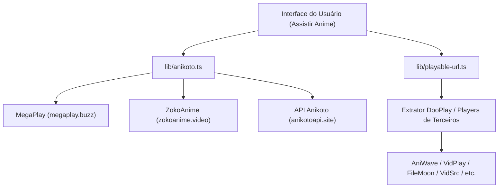

# Documentação de Provedores de Embed e Streaming de Animes

Esta documentação descreve a arquitetura de fontes de vídeo, APIs e resolvedores de players de embed utilizados para streaming de animes na plataforma **PrimerTV**.

---

## 1. Visão Geral da Arquitetura

O sistema de exibição de animes do PrimerTV opera combinando metadados de catálogo (via AniList, MAL e Anikoto) com provedores de streaming dinâmicos e um resolvedor de URLs de vídeo com fallback para players de terceiros.

---

## 2. Provedores Principais de Anime

### 2.1 MegaPlay
* **URL Base:** `https://megaplay.buzz`
* **Descrição:** Provedor primário de player com suporte a faixas legendadas (*Sub*) e dubladas (*Dub*).
* **Formatos de Endpoint:**
  * **Via AniList:** `/stream/ani/{anilistId}/{episodeNumber}/sub` e `/dub`
  * **Via MyAnimeList (MAL):** `/stream/mal/{malId}/{episodeNumber}/sub` e `/dub`
  * **Via Temporada/Episódio Direto:** `/stream/s-{seasonNumber}/{episodeEmbedId}/sub` e `/dub`

### 2.2 VidNest
* **URL Base:** `https://vidnest.fun`
* **Descrição:** Provedor de embed de anime baseado em AniList ID.
* **Formatos de Endpoint:**
  * **Via AniList:** `/anime/{anilistId}/{episodeNumber}/sub` e `/dub`

### 2.3 ZokoAnime
* **URL Base:** `https://zokoanime.video`
* **Descrição:** Provedor secundário de alta disponibilidade para player de animes.
* **Formatos de Endpoint:**
  * **Via AniList:** `/stream/ani/{anilistId}/{episodeNumber}/sub` e `/dub`
  * **Via MyAnimeList (MAL):** `/stream/mal/{malId}/{episodeNumber}/sub` e `/dub`

### 2.4 API Anikoto
* **URL Base:** `https://anikotoapi.site`
* **Descrição:** Serviço REST responsável por fornecer o catálogo de episódios de animes, mapeamento de relançamentos recentes e identificadores de episódios.

---

## 3. Extrator e Resolvedor de Players Genéricos (`lib/playable-url.ts`)

A função `resolvePlayableUrl` processa URLs de reprodução antes da renderização no iframe para identificar e resolver players conhecidos ou extrair fontes de vídeo diretas (`.mp4`, `.m3u8`).

### Lista de Embeds Suportados:

| Provedor / Domínio | Padrão Reconhecido | Descrição |
| :--- | :--- | :--- |
| **AniWave** | `aniwave.to` | Player de animes de terceiros |
| **VidPlay** | `vidplay.site` | Servidor de hospedagem de vídeo |
| **FileMoon** | `filemoon.sx` | Embed de vídeo com player HTML5 |
| **VizCloud** | `vizcloud.online` | Servidor de streaming |
| **MCloud** | `mcloud.to` | Player responsivo de terceiros |
| **VidSrc** | `vidsrc.me`, `vidsrc.to` | Embeds de filmes/séries e animes |
| **Embed.su** | `embed.su` | Provedor de embed universal |
| **2Embed / MyEmbed** | `2embed.cc`, `myembed.biz` | Agregador de players |
| **Plataformas de Vídeo** | YouTube, Vimeo, Dailymotion, Blogger | Integradores padrão |

---

## 4. Localização dos Arquivos no Código

* [lib/anikoto.ts](file:///home/primer/Documents/primertv/lib/anikoto.ts) - Definição dos provedores MegaPlay, ZokoAnime e integração com AniList/MAL.
* [lib/playable-url.ts](file:///home/primer/Documents/primertv/lib/playable-url.ts) - Lógica de validação e extração de URLs de embed de terceiros.
* [app/[locale]/watch/[publicId]/[slug]/page.tsx](file:///home/primer/Documents/primertv/app/%5Blocale%5D/watch/%5BpublicId%5D/%5Bslug%5D/page.tsx) - Página de exibição do player de vídeo.
