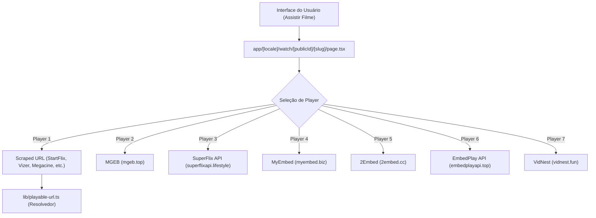

# Documentação de Provedores de Embed e Streaming de Filmes

Esta documentação descreve a arquitetura de fontes de vídeo, APIs e resolvedores de players de embed utilizados para streaming de filmes no projeto **PrimerTV**.

---

## 1. Visão Geral da Arquitetura

O sistema de exibição de filmes do PrimerTV utiliza o identificador do TMDB (`tmdbId`) para montar dinamicamente players de embed de múltiplos provedores de terceiros, além de permitir o uso de URLs raspadas (scraped URLs) obtidas pelos scrapers do worker em Rust.

---

## 2. Provedores Principais de Filmes (via TMDB ID)

Na rota de reprodução ([app/[locale]/watch/[publicId]/[slug]/page.tsx](file:///home/primer/Documents/primertv/app/%5Blocale%5D/watch/%5BpublicId%5D/%5Bslug%5D/page.tsx)), são oferecidas até 7 opções de player:

### 2.1 MGEB / MgEmbed (Player 2)
* **URL Base:** `https://mgeb.top`
* **Formato de Endpoint:** `/embed/{tmdbId}`
* **Descrição:** Provedor primário por TMDB ID (usado como padrão quando não há Scraped URL).

### 2.2 SuperFlix API (Player 3)
* **URL Base:** `https://superflixapi.lifestyle`
* **Formato de Endpoint:** `/filme/{tmdbId}`
* **Descrição:** Provedor de embed em português (dublado/legendado).

### 2.3 MyEmbed (Player 4)
* **URL Base:** `https://myembed.biz`
* **Formato de Endpoint:** `/filme/{tmdbId}`
* **Descrição:** Agregador de players alternativo.

### 2.4 2Embed (Player 5)
* **URL Base:** `https://www.2embed.cc`
* **Formato de Endpoint:** `/embed/{tmdbId}`
* **Descrição:** Provedor global de embeds de filmes via TMDB ID.

### 2.5 EmbedPlay API (Player 6)
* **URL Base:** `https://embedplayapi.top`
* **Formato de Endpoint:** `/embed/{tmdbId}`
* **Descrição:** Provedor secundário para contingência.

### 2.6 VidNest (Player 7)
* **URL Base:** `https://vidnest.fun`
* **Formato de Endpoint:** `/movie/{tmdbId}`
* **Descrição:** Provedor de embed de filmes via TMDB ID.

### 2.7 Fonte Scraped / Direta (Player 1)
* **URL:** Cadastrada no campo `videoUrl` do filme.
* **Fontes do Scraper:** `StartFlix`, `Vizer`, `Megacine`, `TheFilmes`, `OnlyFlix`.
* **Resolvedor:** URLs do Player 1 são verificadas por `resolvePlayableUrl` em [lib/playable-url.ts](file:///home/primer/Documents/primertv/lib/playable-url.ts) para extração de HTML5 Video (`.mp4`, `.m3u8`) ou redirecionamentos de DooPlay/terceiros.

---

## 3. Localização no Código Fonte

* [app/[locale]/watch/[publicId]/[slug]/page.tsx](file:///home/primer/Documents/primertv/app/%5Blocale%5D/watch/%5BpublicId%5D/%5Bslug%5D/page.tsx#L1035-L1110) - Lógica de seleção e renderização dos players de filmes.
* [lib/playable-url.ts](file:///home/primer/Documents/primertv/lib/playable-url.ts) - Extrator e resolvedor de URLs de mídia.
* [docs/fontes_de_dados.md](file:///home/primer/Documents/primertv/docs/fontes_de_dados.md) - Documentação de coleta e scrapers do worker.
