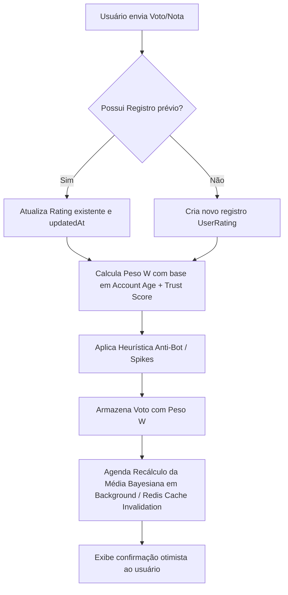

# Regra de Negócio: Sistema de Avaliação Anti-Review Bombing

Este documento especifica a regra de negócio para o sistema de avaliação (rating / votos) de animes, séries, filmes e episódios na plataforma PrimerTV. O objetivo principal é **proteger a integridade das notas públicas contra ataques de review bomb**, garantindo ao mesmo tempo uma experiência amigável e não frustrante para novos usuários.

---

## 1. Princípio Fundamental

Em vez de proibir contas novas de votar — o que causa frustração e bloqueia engajamento legítimo —, **todos os usuários autenticados podem votar desde o primeiro dia**. No entanto, a **influência (peso)** do voto na nota pública ponderada varia gradualmente de acordo com a maturidade e atividade da conta.

---

## 2. Sistema de Pesos por Maturidade e Confiança da Conta

O peso ($W_{user}$) do voto na nota agregada é atribuído dinamicamente com base na idade da conta e no nível de atividade:

| Idade / Status da Conta | Pode Votar? | Peso na Nota Pública ($W$) | Descrição / Raciocínio |
| :--- | :---: | :---: | :--- |
| **< 24 horas** | ✅ Sim | **0.00** (ou `0.10`) | O voto é registrado no perfil do usuário, mas tem impacto nulo ou residual na nota global para coibir bots instantâneos. |
| **1 a 7 dias** | ✅ Sim | **0.25** | Entrada gradual de confiança. |
| **7 a 30 dias** | ✅ Sim | **0.50** | Conta em maturação. |
| **30+ dias** | ✅ Sim | **1.00** | Peso padrão completo. |
| **Conta Antiga + Atividade Regular** | ✅ Sim | **1.10 – 1.25** | *Trust Score Booster*: Contas ativas por meses com histórico amplo de consumo e avaliações variadas ganham peso extra. |

### Exibição para o Usuário
O usuário **nunca** recebe mensagens punitivas do tipo:
> ❌ *"Sua conta é nova demais para votar."*

Em vez disso, a interface confirma a ação normalmente:
> ✅ *"Seu voto foi registrado com sucesso! Conforme sua conta ganha histórico na plataforma, a relevância do seu voto na média pública aumenta."*

---

## 3. Modelo de Voto Único com Edição Livre

Cada usuário possui **apenas 1 registro de avaliação por obra ou episódio**. No entanto, a edição é permitida a qualquer tempo.

### Estrutura dos Dados (Exemplo de Entidade)
```text
UserRating
 ├── userId: String
 ├── mediaId: String (Anime / Series / Movie / Episode)
 ├── rating: Int (ex: 1 a 10)
 ├── review: Text (Opcional)
 ├── weightAtVote: Float (Calculado / Atualizado)
 ├── createdAt: DateTime
 └── updatedAt: DateTime
```

- **Criação**: Quando o usuário avalia uma obra pela primeira vez (`createdAt`).
- **Edição**: Se o usuário mudar a nota depois de um mês assistindo mais episódios, o registro existente é atualizado (`updatedAt` e `rating` alterados), preservando um único voto por obra por usuário.
- **Evolução da Conta**: Quando o `trust_score` ou a idade da conta aumenta, o peso do voto existente é recalculado na próxima agregação sem que o usuário precise votar novamente.

---

## 4. Agregação por Média Bayesiana (Bayesian Average Rating)

Para evitar que obras com poucas avaliações e notas extremas (ex: 10 avaliações com nota 10.0) desloquem obras consolidadas com dezenas de milhares de votos, a nota pública não é uma média aritmética simples.

Utilizamos a **Média Bayesiana Ponderada**:

$$\text{Score} = \left(\frac{V}{V + M}\right) \cdot R + \left(\frac{M}{V + M}\right) \cdot C$$

Onde:
- **$R$ (Média Ponderada Real)**:
  $$R = \frac{\sum_{i=1}^{n} (\text{Rating}_i \cdot W_i)}{\sum_{i=1}^{n} W_i}$$
- **$V$ (Soma Ponderada dos Votos)**:
  $$V = \sum_{i=1}^{n} W_i$$
- **$C$ (Média Global da Plataforma)**: A média ponderada de todas as avaliações de todas as obras no catálogo (ex: `7.2`).
- **$M$ (Mínimo de Confiança)**: Número/massa de votos ponderados mínimos exigidos para estabilizar a nota (ex: $M = 50$ ou $M = 100$).

### Vantagens
1. Obras recém-lançadas com poucos votos começam com notas próximas à média global $C$ e convergem organicamente para $R$ conforme acumulam votos confiáveis.
2. Review bombs instantâneos em obras novas ou populares são amortecidos pela constante de confiança $M$ e pelos pesos reduzidos de contas novas.

---

## 5. Detecção e Mitigação de Comportamento Anômalo

Além dos pesos por idade de conta, o sistema conta com uma camada de heurística para detectar ataques coordenados:

1. **Spikes Temporais**:
   - Detecção de picos fora do desvio padrão de avaliações em uma mesma obra dentro de poucas horas.
2. **Padrão de Notas Extremas por Contas Sem Histórico**:
   - Contas que avaliam exclusivamente 1 ou 10 em pouquíssimas obras sem consumir o conteúdo têm seus votos marcados temporariamente com peso zero (`weight = 0.0`) para análise automatizada.
3. **Correlação de Device / IP / Impressões**:
   - Múltiplas avaliações originadas do mesmo hash de dispositivo ou IP em intervalos curtos são agrupadas e ponderadas como um único voto coletivo.
4. **Isolamento de Crise (Circuit Breaker)**:
   - Em caso de ataque massivo detectado em uma obra específica, o sistema pode congelar temporariamente a atualização da nota pública Bayesiana por até 24h para auditoria dos logs de auditoria.

---

## 6. Resumo do Fluxo de Execução



---

## 7. Próximos Passos de Implementação
1. **Schema Prisma**: Criar modelo `UserRating` / atualizar `EpisodeVote` com suporte a `weight`, `trust_score` no usuário.
2. **Helper de Trust & Weight**: Criar utilitário `calculateUserVoteWeight(user)` em `lib/rating/trust.ts`.
3. **Cálculo Bayesiano**: Criar função `calculateBayesianScore(mediaId)` em `lib/rating/bayesian.ts`.
4. **Integração nas Server Actions / Components**: Conectar com os componentes `StarRatingModal`, `VoteButtons` e exibições de score nas páginas de detalhes.
