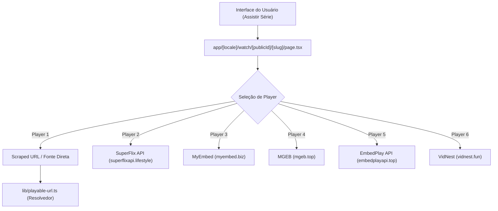

# Documentação de Provedores de Embed e Streaming de Séries

Esta documentação descreve a arquitetura de fontes de vídeo, APIs e resolvedores de players de embed utilizados para streaming de séries de TV e episódios na plataforma **PrimerTV**.

---

## 1. Visão Geral da Arquitetura

O sistema de exibição de séries do PrimerTV combina os metadados do catálogo com identificadores externos (como TMDB ID) para montar dinamicamente players de embed de múltiplos provedores, além de oferecer fallback para URLs raspadas (scraped URLs).

---

## 2. Provedores Principais de Séries

Os players são construídos dinamicamente na rota `/watch` com base no `tmdbId`, no número da temporada (`seriesEpisode.season.number`) e no número do episódio (`seriesEpisode.number`).

### 2.1 SuperFlix API (Player 2)
* **URL Base:** `https://superflixapi.lifestyle`
* **Formato de Endpoint:** `/serie/{tmdbId}/{seasonNumber}/{episodeNumber}`
* **Descrição:** Provedor primário via TMDB ID para séries dubladas/legendadas.

### 2.2 MyEmbed (Player 3)
* **URL Base:** `https://myembed.biz`
* **Formato de Endpoint:** `/serie/{tmdbId}/{seasonNumber}/{episodeNumber}`
* **Descrição:** Provedor alternativo de embeds com suporte a séries.

### 2.3 MGEB / MgEmbed (Player 4)
* **URL Base:** `https://mgeb.top`
* **Formato de Endpoint:** `/embed/{tmdbId}/{seasonNumber}/{episodeNumber}`
* **Descrição:** Agregador de players para episódios de séries.

### 2.4 EmbedPlay API (Player 5)
* **URL Base:** `https://embedplayapi.top`
* **Formato de Endpoint:** `/embed/{tmdbId}/{seasonNumber}/{episodeNumber}`
* **Descrição:** Provedor de embed secundário para contingência e fallback.

### 2.5 VidNest (Player 6)
* **URL Base:** `https://vidnest.fun`
* **Formato de Endpoint:** `/tv/{tmdbId}/{seasonNumber}/{episodeNumber}`
* **Descrição:** Provedor de embed de séries via TMDB ID.

### 2.6 Fonte Scraped / Direta (Player 1)
* **Descrição:** URL cadastrada diretamente no banco de dados para o episódio (`videoUrl`).
* **Resolvedor:** Passa pela função `resolvePlayableUrl` em `lib/playable-url.ts` para resolver redirecionamentos, decodificar iframes ou reproduzir arquivos `.mp4` / `.m3u8` via HTML5 Video Player.

---

## 3. Séries de Anime

Para séries no formato de Anime, o sistema utiliza uma camada dedicada documentada em detalhes em [docs/anime-embeds.md](file:///home/primer/Documents/primertv/docs/anime-embeds.md):
* **MegaPlay (`megaplay.buzz`)**: Suporte a Legendado (Sub) e Dublado (Dub) via AniList / MAL ID.
* **ZokoAnime (`zokoanime.video`)**: Player de contingência para animes.
* **VidNest (`vidnest.fun`)**: Provedor de embed de animes baseado em AniList ID.

---

## 4. Localização no Código Fonte

* [app/[locale]/watch/[publicId]/[slug]/page.tsx](file:///home/primer/Documents/primertv/app/%5Blocale%5D/watch/%5BpublicId%5D/%5Bslug%5D/page.tsx#L808-L865) - Construção das opções de player de séries e renderização do `iframe` / `video`.
* [lib/playable-url.ts](file:///home/primer/Documents/primertv/lib/playable-url.ts) - Resolução e verificação de domínios conhecidos e links de vídeo diretos.
* [docs/anime-embeds.md](file:///home/primer/Documents/primertv/docs/anime-embeds.md) - Documentação específica para embeds de animes.
